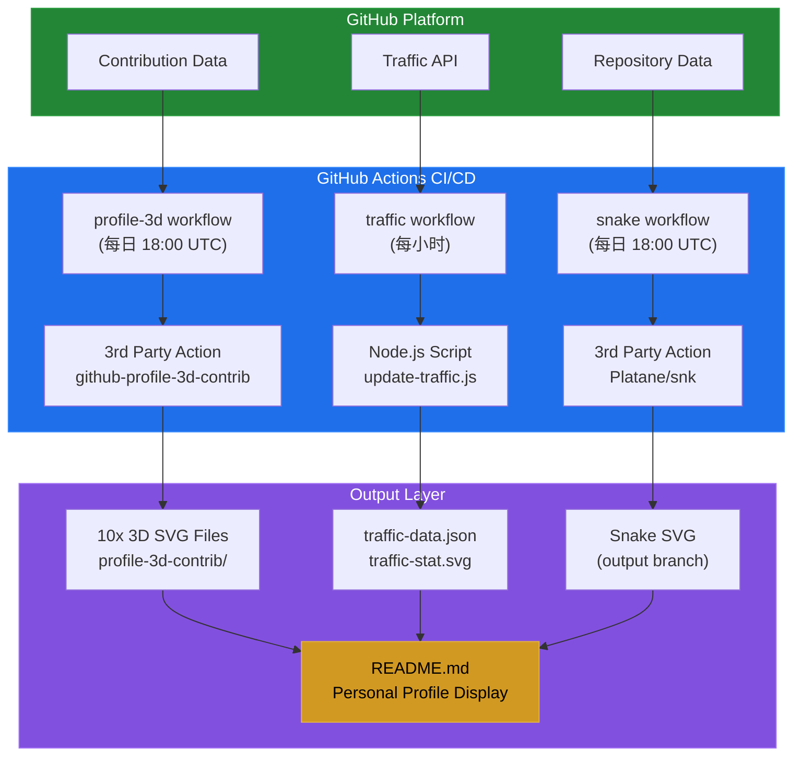
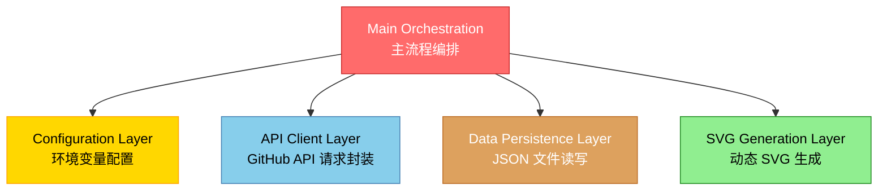
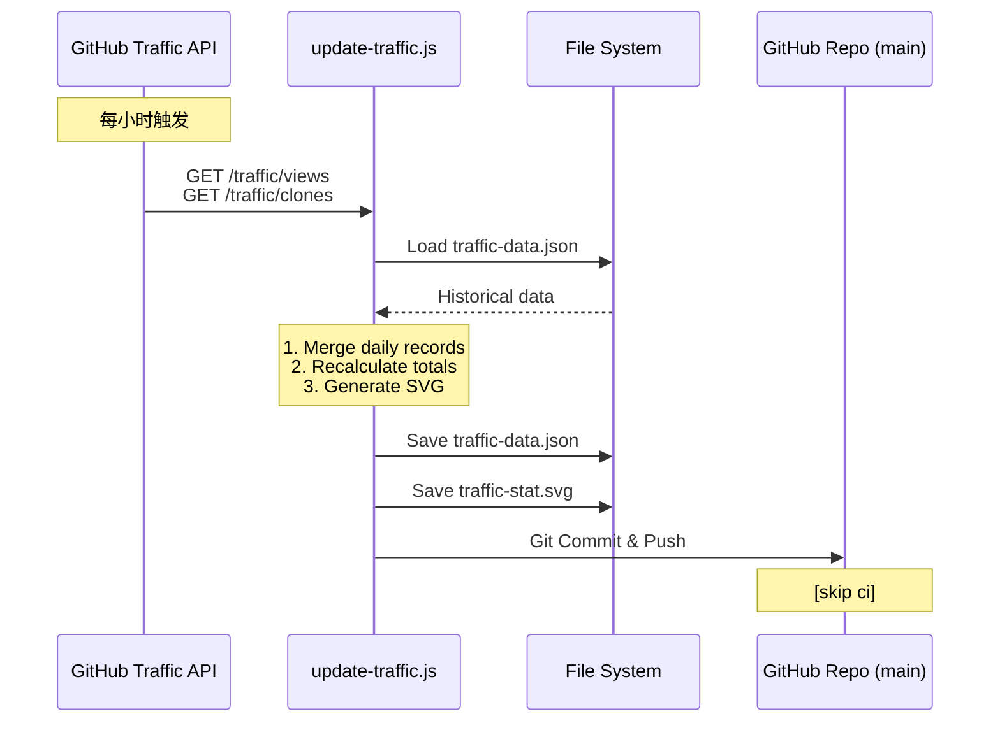
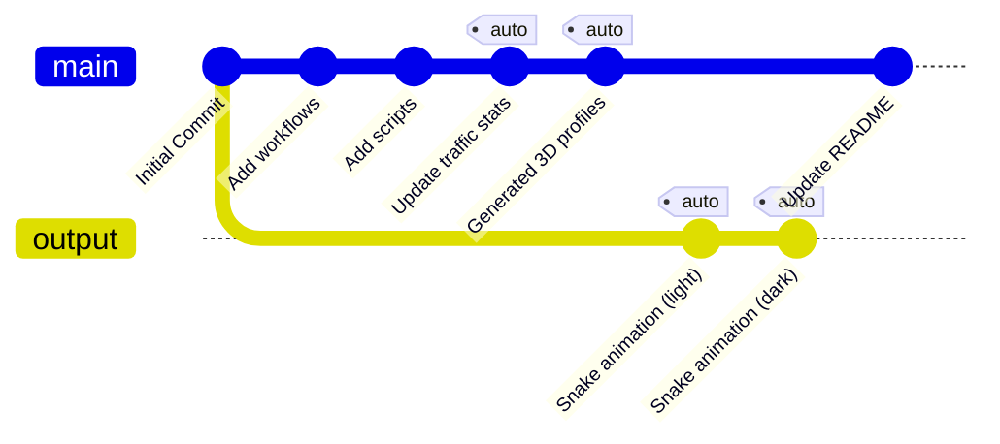
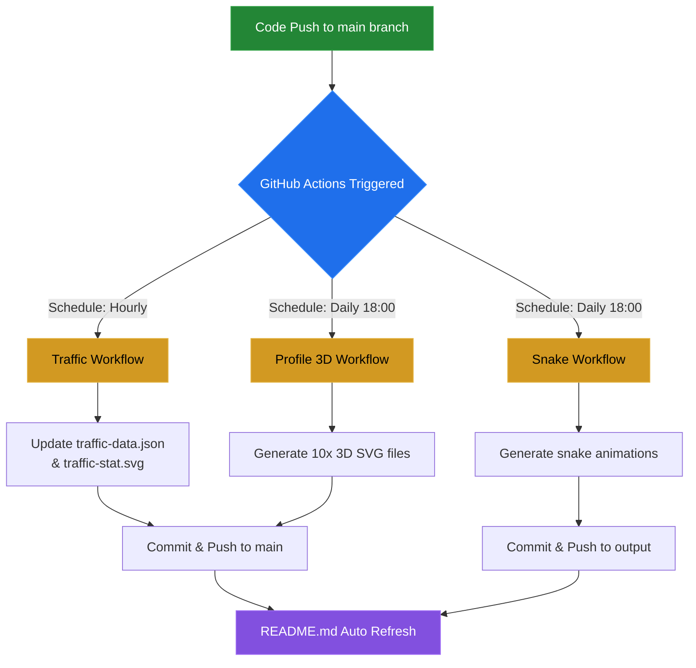
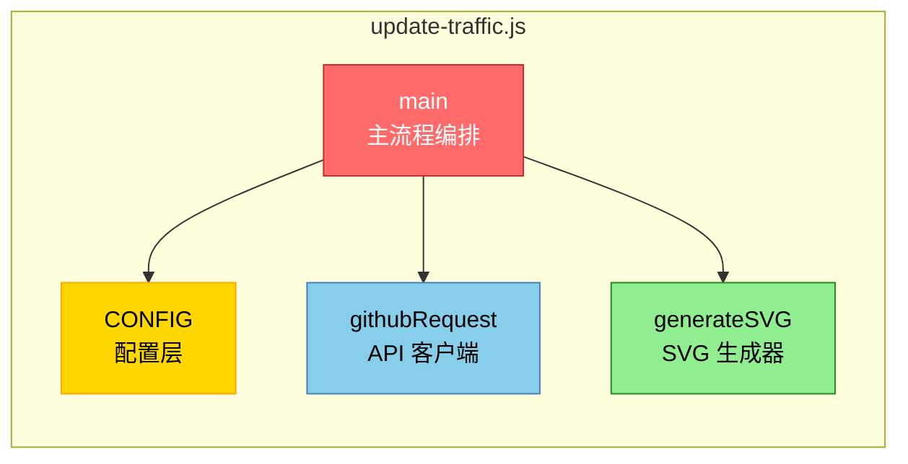

# Exposir 项目技术架构文档

## 📋 目录
- [项目概述](#项目概述)
- [系统架构](#系统架构)
- [技术栈](#技术栈)
- [核心模块](#核心模块)
- [数据流设计](#数据流设计)
- [自动化流程](#自动化流程)
- [API 集成](#api-集成)
- [安全机制](#安全机制)
- [部署架构](#部署架构)

---

## 项目概述

**项目名称**: Exposir
**项目定位**: GitHub 个人资料动态展示与数据可视化系统
**核心价值**: 通过自动化流程实时收集并可视化 GitHub 用户的代码贡献和仓库流量数据
**仓库地址**: https://github.com/exposir/exposir

---

## 系统架构

### 整体架构图



### 架构特点

- **无服务器架构**: 完全基于 GitHub Actions，无需独立服务器
- **事件驱动**: 通过定时任务和 Git 事件触发工作流
- **数据持久化**: 利用 Git 仓库本身作为数据存储
- **原子化模块**: 三个独立工作流互不干扰，各司其职

---

## 技术栈

### 核心技术

| 技术类别 | 技术选型 | 版本/说明 |
|---------|---------|----------|
| **CI/CD 平台** | GitHub Actions | 云原生自动化平台 |
| **脚本语言** | Node.js | v16 |
| **运行环境** | Ubuntu Latest | GitHub Actions Runner |
| **数据格式** | JSON + SVG | 数据存储 + 可视化 |
| **版本控制** | Git | 代码与数据版本管理 |

### 开发工具链

```yaml
语言: JavaScript (ES6+)
运行时: Node.js 16.x
模块系统: CommonJS
依赖管理: 无外部 npm 依赖 (纯内置模块)
代码风格: 原生 JS，无需构建工具
```

### 第三方服务/Action

| 服务/Action | 用途 | 版本 |
|------------|------|------|
| `yoshi389111/github-profile-3d-contrib` | 3D 贡献图生成 | 0.7.1 |
| `Platane/snk` | 贡献热力图蛇形动画 | v3 |
| `crazy-max/ghaction-github-pages` | GitHub Pages 部署 | v3.1.0 |
| `actions/checkout` | 代码检出 | v3 |
| `actions/setup-node` | Node.js 环境配置 | v3 |

---

## 核心模块

### 1. 流量统计系统 (Traffic Counter)

**文件位置**: `scripts/update-traffic.js`

#### 功能职责
- 从 GitHub Traffic API 获取仓库访问数据
- 合并历史数据，避免 14 天滑动窗口导致的数据丢失
- 生成赛博朋克风格的 SVG 仪表板
- 持久化存储流量历史记录

#### 技术实现

**核心模块划分**:



#### 关键算法

**数据合并策略**:
```javascript
// 按日期合并，避免 GitHub API 14天窗口限制
viewsData.views.forEach(day => {
    const dateStr = day.timestamp.split('T')[0];
    history.daily[dateStr] = {
        views: day.count,
        uniques: day.uniques
    };
});

// 累计计算总量
totalViews = sum(history.daily[*].views);
totalUniques = sum(history.daily[*].uniques);
```

**SVG 数据可视化**:
- 动态坐标计算: 使用 Polyline 绘制 14 天趋势线
- 数据归一化: `y = chartYBase - ((val / maxVal) * chartHeight)`
- CSS 动画: 脉动效果、旋转效果、描边动画

#### 数据结构

```json
// traffic-data.json
{
  "total_views": 3,
  "total_uniques": 2,
  "daily": {
    "2025-12-22": { "views": 1, "uniques": 1 },
    "2025-12-29": { "views": 2, "uniques": 1 }
  },
  "updated_at": "2025-12-29T17:55:25.627Z"
}
```

### 2. 3D 贡献图系统 (Profile 3D)

**工作流**: `.github/workflows/profile-3d.yml`

#### 功能职责
- 调用第三方 Action 生成 3D 立体贡献图
- 输出 10 种不同主题样式
- 自动提交更新到仓库

#### 输出清单

```
profile-3d-contrib/
├── profile-gitblock.svg           # Git 块状风格
├── profile-green-animate.svg      # 绿色动画
├── profile-green.svg              # 经典绿色
├── profile-night-green.svg        # 夜间绿色
├── profile-night-rainbow.svg      # 夜间彩虹 ⭐ (主展示)
├── profile-night-view.svg         # 夜间视图
├── profile-season-animate.svg     # 季节动画
├── profile-season.svg             # 季节主题
├── profile-south-season-animate.svg  # 南半球季节动画
└── profile-south-season.svg       # 南半球季节
```

### 3. 贡献蛇形动画 (Snake Animation)

**工作流**: `.github/workflows/snake.yml`

#### 功能职责
- 生成"贪吃蛇"吃掉贡献方块的动画
- 支持明亮/暗黑双主题
- 部署到 `output` 分支

#### 技术特性
- **独立分支策略**: 输出到 `output` 分支，与主分支隔离
- **CDN 引用**: 通过 `raw.githubusercontent.com` 直接引用
- **路径忽略**: 避免 `dist/**` 变更触发无限循环

---

## 数据流设计

### 流量数据流



### 3D 贡献图数据流


---

## 自动化流程

### 定时任务策略

| 工作流 | Cron 表达式 | 执行频率 | 执行时间 (UTC) |
|-------|------------|---------|---------------|
| Traffic Counter | `0 * * * *` | 每小时 | 每小时整点 |
| Profile 3D | `0 18 * * *` | 每天 | 18:00 (北京 02:00) |
| Snake Animation | `0 18 * * *` | 每天 | 18:00 (北京 02:00) |

### 触发机制

**1. 定时触发 (Schedule)**
```yaml
on:
  schedule:
    - cron: "0 * * * *"
```

**2. 手动触发 (Manual)**
```yaml
on:
  workflow_dispatch:
```

**3. 推送触发 (Push)**
```yaml
on:
  push:
    branches:
      - main
    paths-ignore:
      - 'profile-3d-contrib/**'  # 防止循环触发
```

### 防循环机制

```yaml
# profile-3d.yml
paths-ignore:
  - 'profile-3d-contrib/**'  # 忽略自身生成的文件

# snake.yml
paths-ignore:
  - 'dist/**'  # 忽略输出目录

# traffic.yml
commit message: "[skip ci]"  # 提交时跳过 CI
```

---

## API 集成

### GitHub REST API v3

#### 使用的端点

**1. Traffic Views (仓库浏览量)**
```
GET /repos/{owner}/{repo}/traffic/views
```
**响应格式**:
```json
{
  "count": 3,
  "uniques": 2,
  "views": [
    {
      "timestamp": "2025-12-22T00:00:00Z",
      "count": 1,
      "uniques": 1
    }
  ]
}
```

**2. Traffic Clones (仓库克隆量)**
```
GET /repos/{owner}/{repo}/traffic/clones
```

#### 认证机制

```javascript
headers: {
  'User-Agent': 'Node.js Traffic Counter',
  'Authorization': `token ${CONFIG.token}`,
  'Accept': 'application/vnd.github.v3+json'
}
```

#### API 限制与应对

- **Rate Limit**: 使用 Personal Access Token 提升到 5000 次/小时
- **数据窗口**: API 仅返回最近 14 天数据
  - **应对策略**: 每次请求合并到历史 JSON，实现长期存储
- **Token 权限**: 需要 `repo` 权限访问私有仓库流量

---

## 安全机制

### 密钥管理

**GitHub Secrets 使用**:
```yaml
TRAFFIC_TOKEN: ${{ secrets.TRAFFIC_TOKEN }}  # 用户自定义 Token
GITHUB_TOKEN: ${{ secrets.GITHUB_TOKEN }}    # Actions 自动注入
```

**Token 校验**:
```javascript
if (!CONFIG.token) {
  console.error('Error: TRAFFIC_TOKEN secret is missing.');
  process.exit(1);
}

// 防止空格导致的认证失败
token: process.env.TRAFFIC_TOKEN.trim()
```

### 权限控制

**最小权限原则**:
```yaml
permissions:
  contents: write  # 仅写入内容权限
```

### 输入验证

```javascript
// 环境变量解析
const CONFIG = {
  owner: process.env.GITHUB_REPOSITORY.split('/')[0],
  repo: process.env.GITHUB_REPOSITORY.split('/')[1],
  // ...
};

// API 响应状态检查
if (res.statusCode < 200 || res.statusCode >= 300) {
  return reject(new Error(`API Error ${res.statusCode}: ${body}`));
}
```

---

## 部署架构

### 分支策略



**分支说明**:

- `main`: 代码文件 (scripts/, .github/)、数据文件 (traffic-data.json, traffic-stat.svg)、3D 贡献图 (profile-3d-contrib/)
- `output`: Snake 动画 (dist/github-contribution-grid-snake*.svg)

### 自动化部署流程



### 版本控制策略

**提交信息规范**:
```bash
# Traffic 更新
"chore: update traffic stats [skip ci]"

# 3D 贡献图更新
"generated"

# Snake 动画
自动部署到 output 分支，无提交信息
```

**防止冲突**:
- Git 操作前检查: `git diff --quiet && git diff --staged --quiet`
- 仅在有变更时提交: `|| (git commit && git push)`

---

## 性能优化

### 资源优化

- **SVG 矢量图**: 体积小，无限缩放不失真
- **无外部依赖**: 仅使用 Node.js 内置模块，零安装时间
- **增量更新**: 只更新变化的数据文件

### 执行效率

| 工作流 | 平均执行时间 | 资源消耗 |
|-------|------------|---------|
| Traffic Counter | ~30s | 低 (仅 API 请求 + 文件操作) |
| Profile 3D | ~1-2min | 中 (图表生成计算) |
| Snake Animation | ~1min | 中 (动画渲染) |

### 网络优化

- **API 请求**: HTTPS 原生模块，无第三方 HTTP 库开销
- **超时设置**: workflow timeout 5 分钟 (snake.yml)

---

## 扩展性设计

### 模块化结构



### 可配置参数

**SVG 仪表板可定制项**:
```javascript
const width = 800;        // 画布宽度
const height = 120;       // 画布高度
const chartData = recentDays.slice(-14);  // 显示天数
const colors = {
  primary: '#00f3ff',     // 主色调
  secondary: '#bd00ff'    // 副色调
};
```

### 未来扩展方向

1. **多仓库聚合**: 收集多个仓库的流量数据
2. **更多可视化**: 添加其他图表类型 (柱状图、饼图)
3. **数据导出**: 支持导出为 CSV/Excel
4. **告警通知**: 流量异常时发送通知
5. **移动端适配**: 响应式 SVG 设计

---

## 依赖清单

### Node.js 内置模块

```javascript
const fs = require('fs');       // 文件系统操作
const https = require('https'); // HTTPS 请求
const path = require('path');   // 路径处理
```

### GitHub Actions

```yaml
actions/checkout@v3
actions/setup-node@v3
yoshi389111/github-profile-3d-contrib@0.7.1
Platane/snk/svg-only@v3
crazy-max/ghaction-github-pages@v3.1.0
```

---

## 监控与维护

### 日志记录

```javascript
console.log(`Fetching traffic data for ${owner}/${repo}...`);
console.log(`Fetched: ${viewsData.count} views in last 14 days.`);
console.log(`Updated data saved to ${CONFIG.dataFile}`);
console.error('Failed:', error.message);
```

### 错误处理

```javascript
// API 请求失败
if (res.statusCode < 200 || res.statusCode >= 300) {
  return reject(new Error(`API Error ${res.statusCode}`));
}

// 脚本执行失败
catch (error) {
  console.error('Failed:', error.message);
  process.exit(1);
}
```

### 工作流状态监控

- GitHub Actions 面板查看执行历史
- Email 通知 (失败时)
- Workflow badges (可选)

---

## 最佳实践

### 代码规范

1. **环境变量验证**: 启动时检查必需的 Token
2. **API 错误处理**: 完整的状态码检查和异常捕获
3. **文件操作安全**: 使用 `fs.existsSync()` 检查文件存在性
4. **数据验证**: JSON 解析包裹在 try-catch 中

### 工作流规范

1. **权限最小化**: 仅授予必需的 `contents: write`
2. **防止循环**: 使用 `paths-ignore` 和 `[skip ci]`
3. **并发控制**: 工作流互不依赖，可并行执行
4. **超时保护**: 设置 `timeout-minutes` 防止卡死

### 数据管理规范

1. **增量合并**: 保留历史数据，避免丢失
2. **时间戳记录**: 每次更新记录 `updated_at`
3. **格式化输出**: JSON.stringify() 使用缩进 (null, 2)

---

## 故障排除

### 常见问题

**1. TRAFFIC_TOKEN 错误**
```
Error: TRAFFIC_TOKEN secret is missing.
```
**解决方案**: 在仓库 Settings → Secrets 中添加 `TRAFFIC_TOKEN`

**2. API Rate Limit**
```
API Error 403: rate limit exceeded
```
**解决方案**: 使用 Personal Access Token，限制提升到 5000/hour

**3. Git 推送冲突**
```
! [rejected] main -> main (fetch first)
```
**解决方案**: 工作流使用 `git pull --rebase` 或增加重试逻辑

**4. SVG 显示空白**
- 检查 `traffic-data.json` 是否有有效数据
- 确认 SVG 路径在 README 中正确引用

---

## 技术债务与改进空间

### 当前限制

1. **Unique 访客统计不准确**: 简单累加每日 uniques，实际应去重
2. **硬编码配置**: 颜色、尺寸等未提取为配置文件
3. **无测试覆盖**: 缺少单元测试和集成测试
4. **错误恢复**: API 失败时未实现重试机制

### 建议改进

1. **配置文件化**: 将 SVG 样式提取为 `config.json`
2. **添加测试**: Jest 单元测试 + GitHub Actions 测试工作流
3. **数据校验**: 使用 JSON Schema 验证数据结构
4. **性能监控**: 记录每次执行时间，识别性能瓶颈

---

## 总结

Exposir 项目采用 **无服务器 + 事件驱动** 的现代化架构，通过 GitHub Actions 实现了完全自动化的数据收集与可视化流程。其核心优势在于：

✅ **零成本运维**: 完全依赖 GitHub 免费资源
✅ **高可靠性**: 分布式执行，单点故障不影响整体
✅ **易于维护**: 代码简洁，无复杂依赖
✅ **可扩展性**: 模块化设计，易于添加新功能

该架构特别适合个人开发者用于构建 GitHub Profile 展示页面，也可作为学习 GitHub Actions、数据可视化和自动化工作流的优秀案例。
